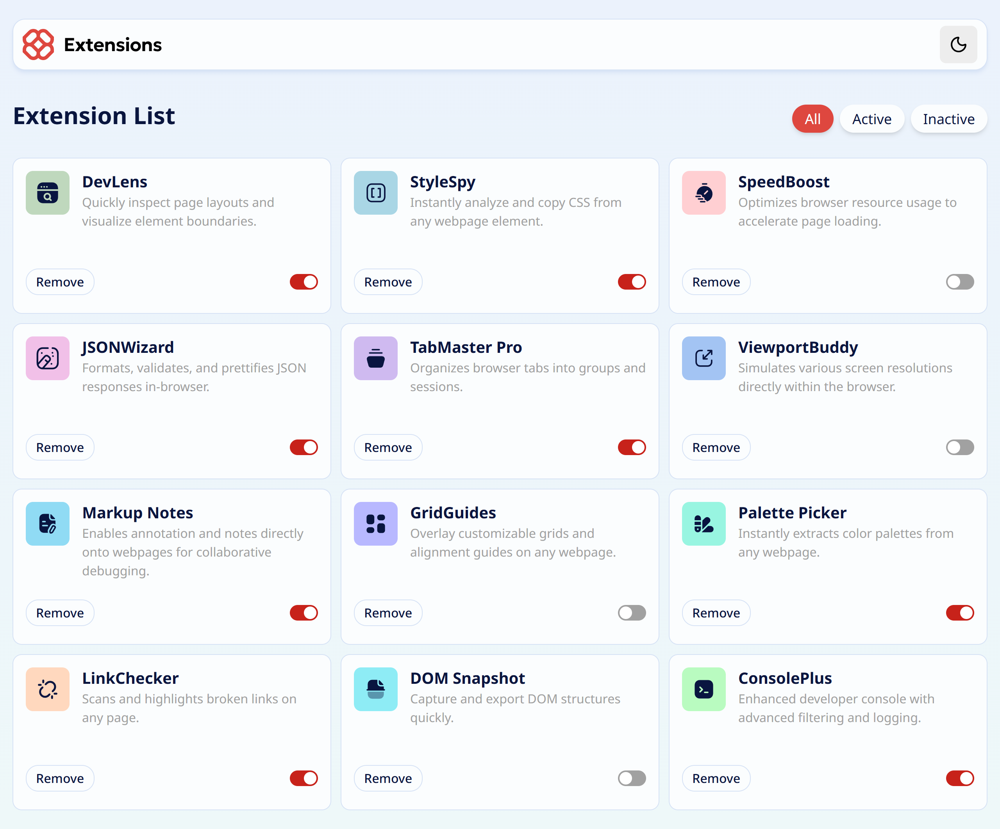

# Frontend Mentor - Solución de la interfaz de administrador de extensiones del navegador

Esta es una solución al desafío [Browser extensions manager UI en Frontend Mentor](https://www.frontendmentor.io/challenges/browser-extension-manager-ui-yNZnOfsMAp). Los desafíos de Frontend Mentor te ayudan a mejorar tus habilidades de programación construyéndo proyectos realistas.

## Tabla de contenidos

- [Resumen](#resumen)
  - [El desafío](#el-desafío)
  - [Captura de pantalla](#captura-de-pantalla)
  - [Enlaces](#enlaces)
- [Mi proceso](#mi-proceso)
  - [Construido con](#construido-con)
  - [Lo que aprendí](#lo-que-aprendí)
- [Autor](#Autor)


---

# Resumen

## El desafío

Los usuarios deberían poder:

- Activar o desactivar extensiones
- Filtrar extensiones activas e inactivas
- Eliminar extensiones de la lista
- Seleccionar su tema de color
- Ver el diseño óptimo de la interfaz según el tamaño de pantalla de su dispositivo
- Ver estados de hover y focus en todos los elementos interactivos de la página

---

## Captura de pantalla


 
---

## Enlaces

- URL de la solución: [https://github.com/feimb/Browser-extension-manager-UI](https://github.com/feimb/Browser-extension-manager-UI)
- URL del sitio en vivo: [https://browser-extension-manager-ui-black.vercel.app/)](https://browser-extension-manager-ui-black.vercel.app/)

---
# Mi proceso

## Construido con

- React
- Tailwind CSS
- Lucide Icons
- Vite
---

## Lo que aprendí
# 🧠 Lo que aprendí

Durante este proyecto aprendí a trabajar mejor con **estado en React** y a actualizar elementos dentro de un array de forma inmutable.

Un ejemplo es el uso del **spread operator** para actualizar propiedades de un objeto:

```javascript
return {
  ...ext,
  isActive: !ext.isActive,
}
```
También practiqué el uso de Tailwind CSS para construir interfaces de forma rápida y mantener un código de estilos limpio.
# Autor
- Linkedin: [Fei Mosqueda](https://www.linkedin.com/in/fei-mosqueda-934036260)
- GitHub: [Feimb](https://github.com/feimb)
